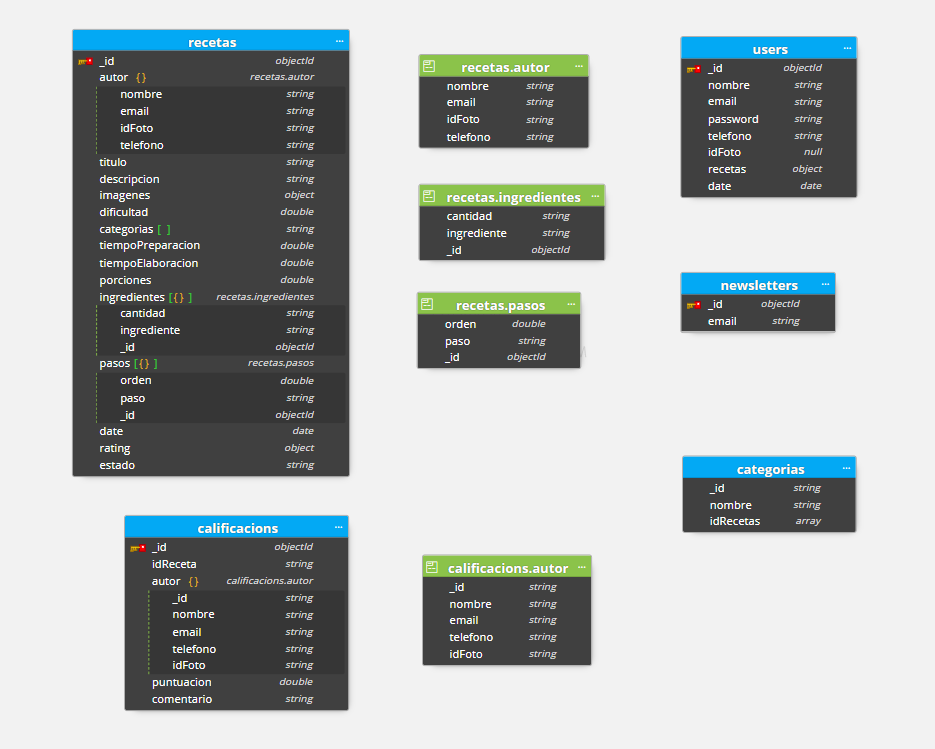

<h1 align="center">
    
</h1>


<p align="center">
  <a href="#introducción">Introducción</a> •
  <a href="#información-general">Información general</a> •
  <a href="#requisitos">Requisitos</a> •
  <a href="#instalación">Instalación</a> •
  <a href="#configuración">Configuración</a> •
  <a href="#mongoDB">MongoDB</a> •
  <a href="#equipo-de-trabajo">Equipo de trabajo</a>
</p>

## Introducción
**Gourmetic** es una aplicación web responsive para la gestión de recetas. Se divide en una parte frontend y otra backend.
* Este README corresponde al backend, el correspondiente al frontend se puede encontrar [acá](https://github.com/GermoAlt/TPO_APLICACIONES_INTERACTIVAS_FRONT/blob/main/README.md).

## Información general
* El backend de **Gourmetic** está desarrollado con API REST NodeJS.

## Requisitos

:bulb: Antes de comenzar, asegúrese de tener todo lo siguiente instalado:

- [ Node.js v14 o superior ](https://nodejs.org/en/download/)
- [ npm v7 o superior ](https://github.blog/2020-10-13-presenting-v7-0-0-of-the-npm-cli/)
- [ Git ](https://git-scm.com/book/en/v2/Getting-Started-Installing-Git/)


## Instalación

Para clonar y ejecutar esta aplicación, necesitará [Git](https://git-scm.com) y [Node.js](https://nodejs.org/en/download/) (que viene con [npm](http://npmjs.com)) instalados en su computadora.

```bash
# Clone this repository
$ git clone https://github.com/GermoAlt/TPO_APLICACIONES_INTERACTIVAS_BACK.git

# Install dependencies
$ npm install

# Run the app
$ npm start
```

## Configuración

### Base de datos
Para la persistencia de datos se utiliza [MongoDB](https://www.mongodb.com/es) con integración de [Mongoose](https://mongoosejs.com/) para el modelado.
* La conexión de MongoDB se encuentra en la clase `main.js` y los datos de configuración en `env.config.js`:
```jsx
    "URI": "mongodb://",
    "HOST":"localhost",
    "PORTDB":27017,
    "DATABASE": "recetas",
```

### Envío de emails
Se debe tener configurada una casilla de email para resetear la contraseña.
* Los datos de configuración se encuentran en `env.config.js`:
```jsx
    "EMAIL_USER": "Replace with email address",
    "EMAIL_PASSWORD": "Replace with email password" 
```

## MongoDB



## Equipo de trabajo
* Aplicaciones interactivas
* Grupo 4
<table>
  <tr>
    <td align="center"><sub><b>German Altairac</b></sub><br /><sub>1084200</sub><br/><a>💻</a></td>
    <td align="center"><sub><b>Tobias Kleppe</b></sub><br /><sub>1130666</sub><br/><a>💻</a></td>
    <td align="center"><sub><b>Belen Enriquez</b></sub><br /><sub>1092598</sub><br/><a>💻</a></td>
  </tr>
</table>

> UADE - Licenciatura en gestión de tecnologías de la información - 2022
